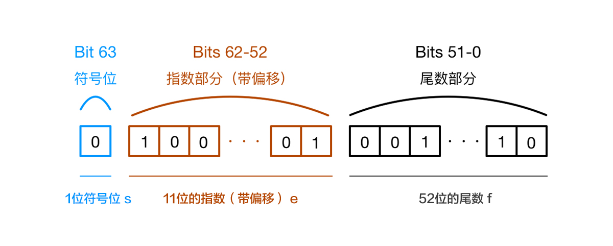

# `Number`
除了一般的数字还包括：
- (+-) `infinity`
- `NaN` 不与任何值相等，如果判断是否是有效数字，用 `isNaN`

## 发生隐式转换的场景

- ==
- `isNaN`
- 数学运算符
- 基本类型比较的是值
- 对象相等性比较的是内存的引用地址是否相同

## 等值比较时的转换规则

1. 是否存在`null`和`undefined`，存在且两边是`null`或`undefined`，返回`true`;存在但只一边是`null`或`undefined`，返回`false`
2. 判断两者类型是否为 `string` 和 `number`，是的话就会将字符串转换为 `number`
3. 判断其中一方是否为 `boolean`，是的话就会把 `boolean` 转为 `number` 再进行判断
4. 判断其中一方是否为 object 且另一方为 string、number 或者 symbol，是的话就会把 object 转为原始类型再进行判断
5. 对象 == 字符串 则把对象转为字符串
6. 两边不同转为数字

```js
let result = 10 + false + undefined + [] + 'Tecent' + null + true + {};
console.log(result)
// 10 + false -> 10 + 0 -> 10
// 10 + undefined -> NaN
// NaN + [] -> NaN + '' -> 'NaN'
// 'NaN' + 'Tecent' -> 'NaNTecent'
// 'NaNTecentnulltrue' + {}
// 'NaNTecentnulltrue' + '[object Object]'
// 'NaNTecentnulltrue[object Object]'

```
## 强制类型转换
### Number()

- 只要出现任何非有效数字字符，结果就是NaN，undefined NaN
- Number("") // 0
- 隐式类型转化使用Number()，触发隐式类型转化
- null，空字符串，NaN结果都是0

### parseInt()和parseFloat()

- 参数是字符串，如果不是字符串，先转化为字符串
- 左侧开始查找，直到不是有效的数字类型停止
- parserInt("") // NaN

```js
parseInt("")  //NaN
Number("")  //0
isNaN("")  //隐式转为isNaN(0) false
parseInt(null)  //parseInt("null") NaN
Number(null)  //0
isNaN(null)  // isNaN(0) false
parseInt("12px")  //12
Number("12px")  //NaN
isNaN("12px")  //isNaN(NaN) true
parseFloat("1.2px") + parseInt("1.2px") + typeof parseInt(null)  //1.2+1+"number" -> "2.2number"
isNaN(Number(!!Number(parseInt("0.8"))))  //false
typeof !parseInt(null) + !isNaN(null)  //"booleantrue"

```

## 问题：在 JavaScript 中，为什么`0.1+ 0.2 !== 0.3` ？

JS采用IEEE 754 标准 用64位表示一个`Number` 。
所以这个问题不仅是在JS中存在，在所有使用了浮点数编码方式来表示浮点数的语音都会产生这类问题，只不过其他语言的标准库里已经处理过了，而JS并没有。



- 第0位：符号位，0表示正数，1表示负数(s)
- 第1位到第11位：储存指数部分（e）
- 第12位到第63位：储存小数部分，即有效数字（f）

因为二进制表示有效数字总是1.xx…xx的形式，尾数部分f在规约形式下第一位默认为1（省略不写，xx..xx为尾数部分f，最长52位），所以JavaScript提供的有效数字最长为53个二进制位（64位浮点的后52位+被省略的1位）。

将0.1和0.2在转换到二进制的过程中尾数会发生无限循环从而导致精度损失。

### 解决方案：

- 浮点数转为整数
- 第三方库 math.js，适合需要高频精度计算的场景。