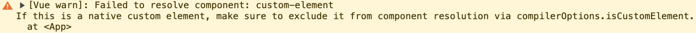

# 组件化基础

## 什么是组件化

将一个复杂系统根据业务和功能拆分为一个个独立的模块，分离每个模块的责任和边界。
组件一般可以分为<HighlightText text="页面组件" />，<HighlightText text="业务组件" />，<HighlightText text="功能组件" />。

## 为什么要组件化

- 未组件化的系统往往<BracketsText text="牵一发而动全身" />
- 便于协同开发
- 利于升级和维护
- 提高代码的复用性
- 提高渲染性能：因为依赖收集系统会以组件为单位（组件在`$mount`时，生成`Watcher`，绑定着当前组件的更新函数。)

## 怎么实现组件化

> 源码地址：`src/core/global-api/assets.js`

- 注册
  - 全局注册: `Vue.component()`：将用户传入的组件配置对象传入`Vue.extend()`，生成组件的构造函数，并且为每一个 Vue 实例合并添加`components`属性
  - 局部注册: `components`选项：单文件组件，vue-loader 会编译 `template` 为 `render` 函数，最终导出的依然是组件配置对象
- 引入
- 交互

::: tip
Vue的编译器在遇到非原生的HTML标签时，会先将它们当做Vue组件处理，而当做自定义元素是后备处理方案。这样会使得Vue抛出一个解析组件失败的错误。



可以通过设置来告诉Vue将哪些元素当做自定义元素。
- 不使用Vite
  ```js
  // 比如将所有带短横线的标签名都视为自定义元素
  app.config.compilerOptions.isCustomElement = (tag) => tag.includes('-')
  ```
- 使用Vite
  ```js
  // vite.config.js
  import vue from '@vitejs/plugin-vue'

  export default {
    plugins: [
      vue({
        template: {
          compilerOptions: {
            isCustomElement: (tag) => tag.includes('-')
          }
        }
      })
    ]
  }
  ```
:::

## 组件技术三要素

属性，事件，插槽

## 组件划分原则

- 高内聚低耦合
- 单向数据流

## 动态组件

使用`is`属性和`component`标签：

```vue
<component :is="currentComponent"></component>
```

## 异步加载


```js
components: {
  'my-component': () => import('./my-async-component')
}
```

## 在父组件中监听子组件的生命周期
```vue
<Child @hook:mounted="doSomething"/>
<Child @hook:updated="doSomething"/>
```

## 在组件上使用`v-model`

`v-model`是`@input`和`:value`的语法糖，所以只要在组件中通过`props`接受一个`value`属性，并且在触发修改时`emit`一个`input`方法就可以：

```js
{
  props: ['value'],
  template: `
    <input
      v-bind:value="value"
      v-on:input="$emit('input', $event.target.value)"
    >
  `
}
```

## 函数式组件

- 特点：无状态(`data`)且无实例(`this`)；渲染开销小。
- 用途：可以用来控制具体视图的显示，只处理逻辑。
- 用法：设置属性`functional: true`
