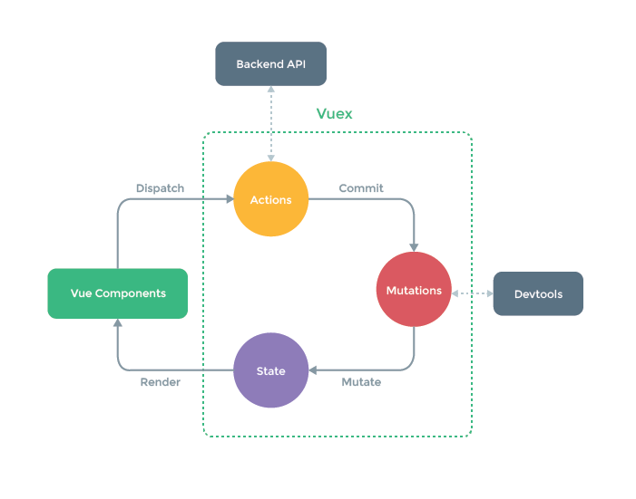

# Vuex 基础



- 专门为 Vue 应用开发的状态管理工具
- 保证状态以可预测的方式发生变化
- 单例模式
- 状态独立于组件树，实现单向数据流
- 借鉴了 Flux，Redux
- Vuex 的状态存储是响应式的。利用了 Vue 的细粒度数据响应机制来进行更高效的状态更新
- 不能直接改变 `store` 中的状态。改变 `store` 中的状态的唯一途径就是显式地<BracketsText text="提交 (commit)" /> `mutation`，使得我们可以方便地跟踪每一个状态的变化，这样可以便于管理和调试

## 实例化

```js
import Vue from "vue";
import Vuex from "vuex";

Vue.use(Vuex);

const store = new Vuex.Store({
  state: {
    count: 0,
  },
  mutations: {
    increment(state) {
      state.count++;
    },
  },
});
```

## `State`

用于存储状态。状态都是响应式的，数据改变则依赖此状态的组件都会更新。

```js
// 使用
computed: {
  count () {
    return this.$store.state.count
  }
},

// 或
computed: {
  ...mapState(['count'])
},
```

并不意味着你需要将<BracketsText text="所有的" /> 状态放入 Vuex。如果有些状态严格属于单个组件，最好还是作为组件的局部状态。你应该根据你的应用开发需要进行权衡和确定，根据自己经验，需要多个组件都可以访问的状态，且多个组件关系不是父子级：

- 登录状态
- 用户信息
- 菜单
- 顶部选项卡

## `Getter`

有一些值是根据`state`计算得出的。使用`getter` 可以理解为 Vuex 的计算属性。可缓存，只有依赖的值变化才重新执行。

参数是`state`。也可以让它返回一个方法来接受参数，这样就不会缓存，对于数组很有用。

```js
const store = new Vuex.Store({
  state: {
    todos: [
      { id: 1, text: "...", done: true },
      { id: 2, text: "...", done: false },
    ],
  },
  getters: {
    doneTodos: (state) => {
      return state.todos.filter((todo) => todo.done);
    },
    getTodoById: (state) => (id) => {
      return state.todos.find((todo) => todo.id === id);
    },
  },
});
```

### 使用

```js
computed: {
  doneTodos () {
    return this.$store.getters.doneTodos
  },
	todo2 () {
		return this.$store.getters.getTodoById(2)
	}
}

// 或
computed: {
	...mapGetters([
		'doneTodos',
	])
}

// 改名
computed: {
	...mapGetters({
	  // 把 `this.doneCount` 映射为 `this.$store.getters.doneTodosCount`
	  doneCount: 'doneTodosCount'
	})
}
```

## `Mutations`

唯一可以修改`state`的途径就是提交`mutation`。
类似于事件。包括一个<BracketsText text="事件类型(type)" />和一个<BracketsText text="回调函数(handler)" />。
在回调函数中来修改`state`。

### 使用

`mutation`接受两个参数：

- `state`
- `payload` 大多数情况应该是个对象

```js
const store = new Vuex.Store({
  state: {
    count: 1,
  },
  mutations: {
    increment(state, payload) {
      // 变更状态
      state.count += payload.amount;
    },
  },
});
```

用`commit`方法来触发`mutation`：

```js
store.commit('increment', { amount: 10 })
// 或
store.commit({
  type: 'increment',
  amount: 10
})

// 组件中
methods: {
  ...mapMutations([
    'increment', // 将 `this.increment()` 映射为 `this.$store.commit('increment')`

    // `mapMutations` 也支持载荷：
    'incrementBy' // 将 `this.incrementBy(amount)` 映射为 `this.$store.commit('incrementBy', amount)`
  ]),
  ...mapMutations({
    add: 'increment' // 将 `this.add()` 映射为 `this.$store.commit('increment')`
  })
}
```

### 规则

- `mutation`都是同步事务（在 `mutation` 中混合异步调用会导致程序很难调试）

因为`state`应是响应式的，所以修改`state`的时候应该注意：

- 提前在 `store` 中初始化好所有所需属性
- 为对象上添加新属性时
  - 使用  `Vue.set(obj, 'newProp', 123)`
  - 使用扩展运算符并替换原对象：`state.obj = { ...state.obj, newProp: 123 }`

### 建议

使用常量作为`mutation`的类型：

```jsx
mutations: {
  [SOME_MUTATION] (state) {
    // mutate state
  }
}
```

## `Action`

- 支持异步
- 在内部调用`mutation`

```js
actions: {
  increment (context) {
    context.commit('increment')
  }
}
// 或
actions: {
  increment ({ commit }, payload) {
    commit('increment')
  }
}
```

### 使用

通过`dispatch` 方法调用`action`：`store.dispatch`  返回 Promise

```js
store.dispatch('incrementAsync', {
  amount: 10
})
// 或
store.dispatch({
  type: 'incrementAsync',
  amount: 10
})

// 组件中使用
methods: {
  ...mapActions([
    'increment', // 将 `this.increment()` 映射为 `this.$store.dispatch('increment')`

    // `mapActions` 也支持载荷：
    'incrementBy' // 将 `this.incrementBy(amount)` 映射为 `this.$store.dispatch('incrementBy', amount)`
  ]),
  ...mapActions({
    add: 'increment' // 将 `this.add()` 映射为 `this.$store.dispatch('increment')`
  })
}
```

### 多个 action

```jsx
actions: {
  async actionA ({ commit }) {
    commit('gotData', await getData())
  },
  async actionB ({ dispatch, commit }) {
    await dispatch('actionA') // 等待 actionA 完成
    commit('gotOtherData', await getOtherData())
  }
}
```

## `Module`

[Vuex 命名空间](https://www.notion.so/Vuex-7fc07f560a74491b9709682de325da46?pvs=21)

## `Strict`

在严格模式下，无论何时发生了状态变更且不是由 mutation 函数引起的，将会抛出错误。这能保证所有的状态变更都能被调试工具跟踪到。

## `Devtools`

打开或关闭 `devtools`。

传入  `false`  的实例来说 Vuex store 不会订阅到 `devtools` 插件

## `Plugins`

Vuex 的 store 接受  `plugins`  选项，这个选项暴露出每次 mutation 的钩子。Vuex 插件就是一个函数，它接收 store 作为唯一参数：

```js
const myPlugin = (store) => {
  // 当 store 初始化后调用
  store.subscribe((mutation, state) => {
    // 每次 mutation 之后调用
    // mutation 的格式为 { type, payload }
  });
};
```

然后像这样使用：

```js
const store = new Vuex.Store({
  // ...
  plugins: [myPlugin],
});
```

- 插件中也只能通过`commit` `mutation`来修改状态
- 可以通过深拷贝来复制 state 生成快照，只应该在开发阶段使用
- 有内置的 logger 日志插件可以用于开发调试

## HMR

使用 Webpack 的  **[Hot Module Replacement API](https://webpack.js.org/guides/hot-module-replacement/)**

## Vuex 项目结构推荐

```
├── index.html
├── main.js
├── api
│   └── ... # 抽取出API请求
├── components
│   ├── App.vue
│   └── ...
└── store
    ├── index.js          # 我们组装模块并导出 store 的地方
    ├── actions.js        # 根级别的 action
    ├── mutations.js      # 根级别的 mutation
    └── modules
        ├── cart.js       # 购物车模块
        └── products.js   # 产品模块
```
